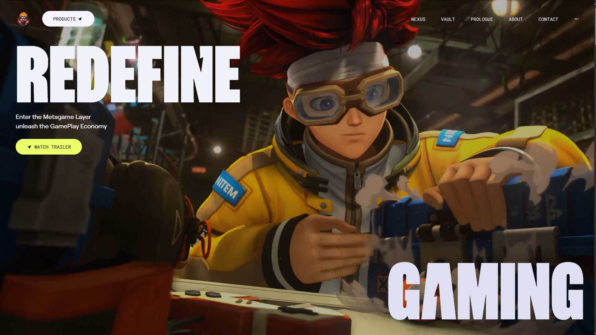
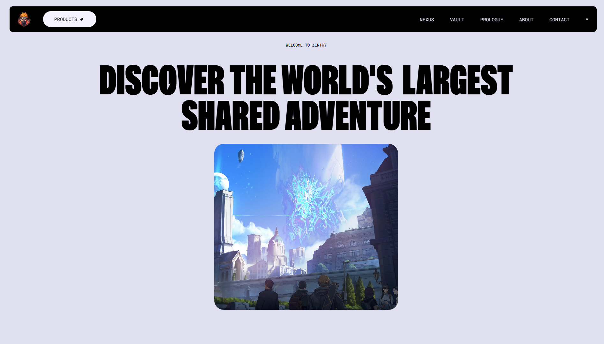
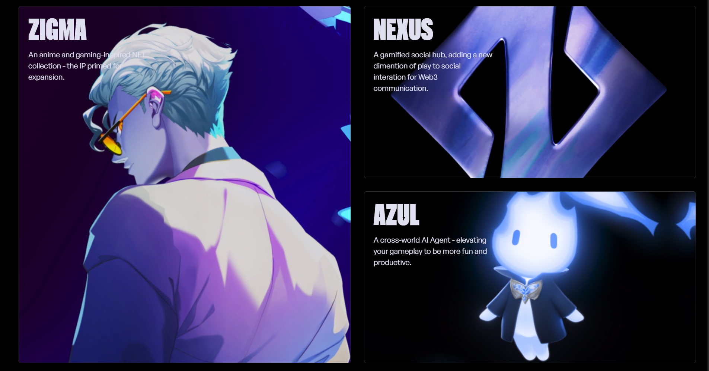
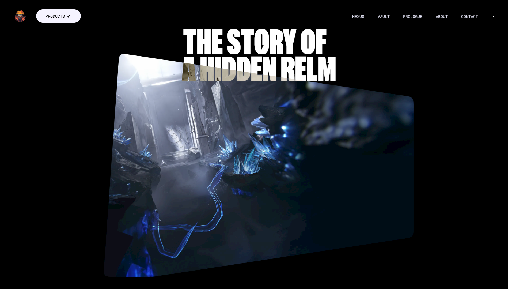
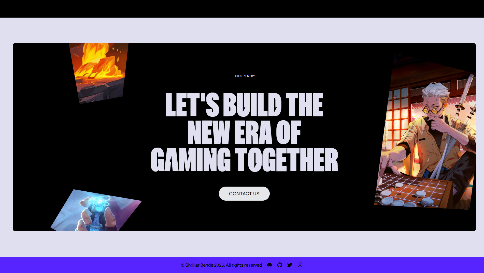

# Zentry.com Clone - A React & GSAP Showcase

This project is a front-end clone of the award-winning website, **[Zentry.com](https://zentry.com)**. It was built to showcase advanced front-end development skills, including component-based architecture with React, utility-first styling with Tailwind CSS, and complex, high-performance animations using the GSAP library.

## ✨ View Live Demo
[🔗 **Live-Shrikar-Gaming-Showcase**](https://shrikar-gaming-showcase.vercel.app/) <!-- Replace with your actual demo link -->

## 📸 Screenshots

### Hero Section


### Main Adventure Section  


### Product Showcase


### Story Section


### Contact Section


## ⚠️ Disclaimer
This project is a clone created for **educational and portfolio purposes only**. It is not affiliated with, sponsored by, or endorsed by the original creators of Zentry.com. This project aims to replicate the front-end functionality and design to showcase technical skills. All credit for the original design and concept goes to the talented team behind Zentry.

## 🎯 Key Features

- **Skill Showcase:** A faithful recreation of a professional, animation-heavy website to demonstrate front-end development capabilities.
- **Stunning Animations:** Silky-smooth animations and scroll-triggered events powered by GSAP, mimicking the original site.
- **Fully Responsive:** A seamless experience across all devices, from mobile phones to desktops.
- **Modern Tech Stack:** Built with Vite for a lightning-fast development experience and optimized builds.
- **Component-Based:** Organized and maintainable code structure using React components.

## 🛠️ Technology Stack

- **Frontend:** React
- **Build Tool:** Vite
- **Styling:** Tailwind CSS
- **Animations:** GSAP (GreenSock Animation Platform)
- **Linting:** ESLint

## ⚙️ Getting Started

To run this project locally, follow these simple steps.

### Prerequisites

- Node.js (v18 or later)
- npm or yarn

### Installation & Setup

1. **Clone the repository:**
   ```bash
   git clone https://github.com/ShrikarBende/Zentry-React-GSAP-Portfolio.git
   ```

2. **Navigate to the project directory:**
   ```bash
   cd Zentry-React-GSAP-Portfolio
   ```

3. **Install dependencies:**
   ```bash
   npm install
   ```

4. **Run the development server:**
   ```bash
   npm run dev
   ```

The application will be available at `http://localhost:5173` (or the next available port).

## 🚀 Available Scripts

- `npm run dev` - Start the development server
- `npm run build` - Build for production
- `npm run preview` - Preview the production build locally
- `npm run lint` - Run ESLint for code quality checks

## 📂 Project Structure

```
Zentry-React-GSAP-Portfolio/
├── public/
├── src/
│   ├── components/
│   ├── assets/
│   ├── styles/
│   └── App.jsx
├── package.json
└── README.md
```

## 🎨 Features Implemented

- **Hero Section** with animated text and visual elements
- **Smooth Scrolling** with GSAP ScrollTrigger
- **Interactive Components** with hover effects and transitions
- **Responsive Design** optimized for all screen sizes
- **Performance Optimized** animations and lazy loading

## 📱 Browser Compatibility

This project is compatible with all modern browsers:
- Chrome (recommended)
- Firefox
- Safari
- Edge


## 📄 License

The code in this repository is licensed under the **MIT License**. See the `LICENSE` file for more details.

---

**A portfolio project by [Shrikar Bende](https://github.com/ShrikarBende)**

## 🙏 Acknowledgments

- Original design inspiration from [Zentry.com](https://zentry.com)
- GSAP for incredible animation capabilities
- React and Vite communities for excellent documentation and support

---

### 📞 Contact

For any questions or collaborations, feel free to reach out:

- **GitHub:** [@ShrikarBende](https://github.com/ShrikarBende)
- **Email:** [shrikarbende@gmail.com](shrikarbende@gmail.com) 
- **Linkedin:** [@Shrikar Bende](https://www.linkedin.com/in/shrikar-bende)

⭐ **If you found this project helpful, please give it a star!**
